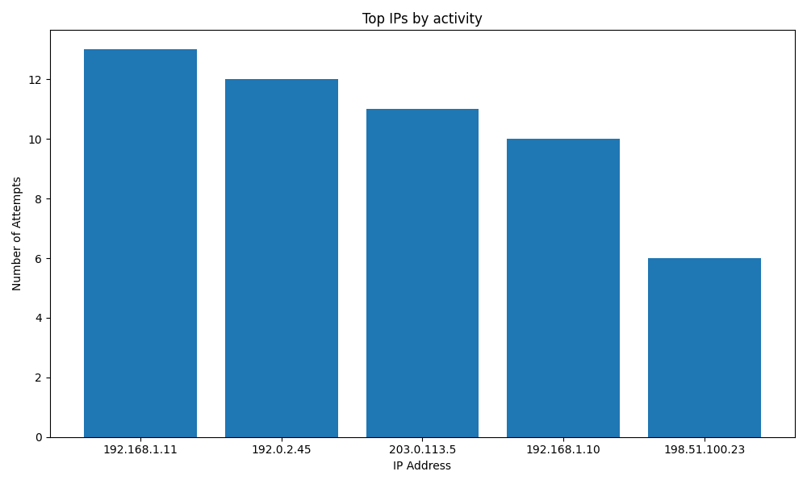

# Mini-Projet Python en groupe (Analyseur de Logs et Scanner Réseau)

Ce projet est réalisé par :

- **Mehdi MEBARKIA**
- **Nadjib BENSEGHIR**
- **Aymen BOUZERKOUNE**

## Description

Ce projet permet d’analyser des fichiers de logs pour identifier des activités suspectes (tentatives d’accès non autorisées, erreurs HTTP, etc.) et de réaliser un scan réseau pour détecter les ports ouverts sur des IPs suspectes. Il constitue un outil d’aide à la détection de comportements malveillants dans un environnement sécurisé.

---

## Technologies utilisées

- **Python 3.13** : langage de programmation pour l’implémentation
- **pandas** : manipulation et analyse des données
- **matplotlib** : visualisation graphique
- **threading** : parallélisation des scans de ports
- **re (regex)** : extraction précise des données dans les logs

---

## Architecture et démarche technique

### 1. Génération d'un ficheir de logs
Le script d'exécution generate_fake_log.py permet de générer un fichier de log, sinon un fichier vous sera fourni pour effectuer les tests.

### 2. Analyse des logs (`log_parser.py`)
- Lecture d’un fichier log (format personnalisé ou standard)
- Extraction des lignes pertinentes : erreurs HTTP, échecs de connexion, etc.
- Isolation des adresses IP sources
- Stockage sous forme de dictionnaire (IP → nombre d’occurrences) et de dictionnaire (IP → User-Agent(s))
- Détection de bots et scanners via le User-Agent

### 3. Analyse et visualisation (`data_analyzer.py`)
- Conversion des résultats en DataFrame pandas
- Classement des IPs par activité
- Génération d’un graphique à barres (Top 5)
- Détection automatique de bots via User-Agent
- Export en CSV et rapport HTML synthétique avec résumé et graphique

### 4. Scanner réseaux (`network_scanner.py`)
- Connexion sur des ports standards (22, 80, 443, 8080, 21)
- Implementation multithreadée pour performance
- Enregistrement des ports ouverts/fermés
- Option verbose pour afficher aussi les ports fermés

### 5. Interface principale (`main.py`)
- CLI avec `argparse`
- Paramètres : fichier log, lancer scan, seuil IP suspecte, mode verbose
- Coordination des étapes et génération automatique des rapports


Remarque: si vous ne disposer pas du fichier log vous pouvez en genrer un avec **generate_fake_log.py**

---

## Choix techniques

- **Multithreading** : pour accélérer le scan des ports
- **Filtrage basé sur le nombre d’accès** : seuil configurable pour détecter IP suspecte
- **Analyse User-Agent** : détection automatique de bots et scanners
- **Rapports complets** (CSV + HTML + graphiques) pour une visualisation claire
- **Modularité** : séparation des fonctionnalités pour faciliter l’enrichissement

---

## Résultats exemplaires

### 1. Graphique
Un graphique en barres montre les 5 IPs les plus actives :



Un graphique en Pie Chart pour voir d'un autre point de vue notre data :


### 2. IP suspectes
Une liste dans le rapport HTML, par exemple :

```html
<h2>IPs Suspects (potentiellement bots)</h2>
<ul>
    <li>192.168.1.10</li>
    <li>192.168.1.11</li>
</ul>
```

### 3. Ports ouverts / fermés
Pour chaque IP suspecte, le rapport indique les ports ouverts et fermés :

IP: 192.168.1.10
Ports ouverts : 22, 80
Ports fermés : 21, 443, 8080

IP: 192.168.1.11
Ports ouverts : 80, 443
Ports fermés : 21, 22, 8080

### 4. Résultats du scan
Stockés dans le CSV et intégrés dans le rapport HTML pour examen.

---

## Usage
Générez un fichier de logs (optionnel, en utilisant un script generate_test_log.py).
Lancez l’analyse et le scan :

```bash
python main.py --logfile web_access.log --scan --verbose --detect 10

--logfile : préciser le fichier log
--scan : activer le scan réseau
--verbose : afficher aussi les ports fermés
--detect : seuil pour IP suspecte (par défaut 10 accès)

```
Les résultats seront accessibles dans :

- full_ip_report.csv (export CSV)
- full_ip_report.html (rapport HTML)

---

## Conclusion

Ce projet combine l’analyse automatique de logs et le scan réseau pour aider à la détection d’activités malveillantes. La modularité facilite l’extension, avec une interface en ligne de commande intuitive.

## Licence

Ce projet est à titre éducatif, utilisez-le avec précaution dans vos environnements.
